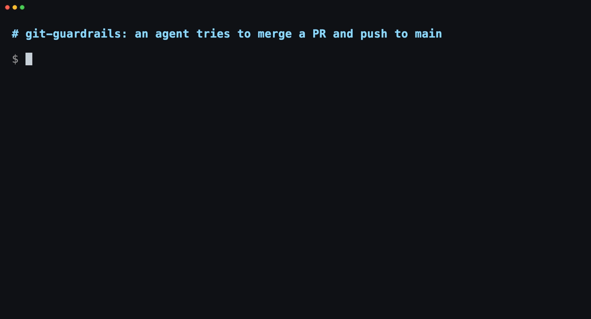

# agent-workbench

[](https://github.com/dimokol/agent-workbench/actions/workflows/test.yml)

Run several Claude Code or Codex agents on one laptop. These plugins stop an agent from merging a
PR you didn't approve or starting a second test run on a machine that's already struggling, and
give agents in different terminals a room to settle an API between themselves.



## Install

```bash
claude plugin marketplace add dimokol/agent-workbench
claude plugin install starter@dimokol
```

Restart Claude Code. starter brings git-guardrails, machine-pressure, worktree-hygiene and
agent-chat. Claude Code may say some options are "not yet set"; the defaults apply. To see one
work, ask "run a health check".

Skills only, for Codex and other agents: `npx skills add dimokol/agent-workbench`.

## What it prevents

- An agent merges a PR, pushes to main or runs `reset --hard` before you said so.
- Four agents start four test suites, and the laptop swaps until nothing responds.
- Two agents in two terminals guess the same field name differently.
- Merged worktrees, idle `node_modules` folders and orphaned dev servers fill the disk.

New to running more than one agent? [Running several agents at once](docs/running-several-agents.md)
is a five-minute read.

## Parts

| Part | What you get | Type |
|---|---|---|
| [git-guardrails](plugins/git-guardrails) | Agents can't merge PRs, push to protected branches, delete remote branches or run `reset --hard` unless you said so. Strict mode also gates every commit and push. | hooks |
| [pr-task-link-guard](plugins/pr-task-link-guard) | `gh pr create` is refused when the body has no link to a task, once you set a task-link pattern. | hook |
| [machine-pressure](plugins/machine-pressure) | Refuses a second e2e or Docker run, and heavy commands while CPU, memory or disk is in the red, plus a statusline script you add by hand. | hook, script |
| [context-nudge](plugins/context-nudge) | One line when a session passes 250k, 400k and 600k tokens, or after an hour idle at 150k or more, so you compact or start fresh. | hook |
| [worktree-hygiene](plugins/worktree-hygiene) | An audit to run at session start: merged worktrees, idle dependency folders, orphaned dev servers, free disk. Proposes, never deletes. | skill |
| [storage-reclaim](plugins/storage-reclaim) | Disk cleanup that measures first and won't touch files a process or session is using. macOS. | skill |
| [agent-chat](plugins/agent-chat) | Chat rooms for agents in different terminals, even in different repos, so they settle an API shape without you relaying. | MCP server |
| [verify-before-building](plugins/verify-before-building) | Fetches and checks the trunk before you branch, so nobody rebuilds what already merged. | skill |
| [pr-review-loop](plugins/pr-review-loop) | Asks the reviewer once, applies or answers every finding, reruns your checks, stops when the PR is ready. Never merges on its own. | skill |
| [integration-branch-qa](plugins/integration-branch-qa) | Test several approved PRs at once on one local branch that never gets pushed, with a clickable checklist and a merge gate. | skill, hook |
| [setup-audit](plugins/setup-audit) | A weekly read of the Claude Code changelog plus your own drift checks, written to a log. | skill |

[blocks/](blocks) holds text to paste into your own `CLAUDE.md` or `AGENTS.md`: a working
agreement between you and the agent, web project standards, a writing tone, a product copy voice,
and a docs layout.

## Settings and other installs

Pick single parts with `claude plugin install <part>@dimokol`. Every setting has a default. Change
one with `/plugin configure <part>@dimokol`; each part's README lists them. Your own hooks stay as
they are. Turn a part off with `claude plugin disable <part>@dimokol`. If you installed starter,
disable `starter@dimokol` first, because it holds its four parts in place.

Without the plugin system, `install.sh` copies a part into place and prints any hook or MCP snippet
for you to paste:

```bash
curl -fsSL https://raw.githubusercontent.com/dimokol/agent-workbench/main/install.sh | bash -s -- --list
curl -fsSL https://raw.githubusercontent.com/dimokol/agent-workbench/main/install.sh | bash -s -- git-guardrails
# Codex: copy skills into Codex's folder
curl -fsSL https://raw.githubusercontent.com/dimokol/agent-workbench/main/install.sh | SKILLS_DIR=~/.codex/skills bash -s -- worktree-hygiene
```

In Codex the skills and agent-chat work; hooks are Claude Code only.

## Also worth installing

Tools that fit with these parts. Linked, not copied.

| What | Why | Install |
|---|---|---|
| [superpowers](https://github.com/obra/superpowers), pr-review-toolkit, feature-dev, claude-md-management, skill-creator | Planning, subagent-driven builds, review agents, CLAUDE.md upkeep | `claude plugin install <name>@claude-plugins-official` |
| [mattpocock/skills](https://github.com/mattpocock/skills): grilling, diagnosing-bugs, pr, handoff | Sharp questions before building, a debug loop that starts from a failing repro, PR bodies, handoff notes | `claude plugin install mattpocock-skills`, or one skill: `npx skills add mattpocock/skills --skill grilling` |
| [pstack](https://github.com/cursor/plugins/tree/main/pstack): unslop, blast-radius, show-me-your-work | Cuts AI tells from writing, finds what a change could break, keeps a decision log | `npx skills add https://github.com/cursor/plugins/tree/main/pstack --skill unslop -a claude-code` (Cursor: `/add-plugin pstack`) |
| [ccstatusline](https://www.npmjs.com/package/ccstatusline) | A configurable statusline; machine-pressure ships widgets for it | `npm install -g ccstatusline` |
| [claude-notifications](https://github.com/dimokol/claude-notifications) (same author) | A sound and an OS banner when a Claude Code session in a VS Code terminal finishes or needs you. On macOS and Windows a click jumps to that window and terminal tab. | [VS Code marketplace](https://marketplace.visualstudio.com/items?itemName=dimokol.claude-notifications) |

## Credits

- [ccstatusline](https://github.com/sirmalloc/ccstatusline) by sirmalloc draws the statusline that machine-pressure's widgets plug into.
- [superpowers](https://github.com/obra/superpowers) by Jesse Vincent shaped how these parts were planned, built and reviewed.
- [mattpocock/skills](https://github.com/mattpocock/skills): its grilling skill settled the design questions, and it has a git-guardrails skill with the same aim as this one.
- [pstack](https://github.com/cursor/plugins/tree/main/pstack): its unslop skill is the stricter checklist `blocks/writing-tone.md` points to, and its worktree-cleanup is the fuller playbook worktree-hygiene points to.
- The demo is recorded with [VHS](https://github.com/charmbracelet/vhs) by Charm.

## License

MIT. See [LICENSE](LICENSE).
